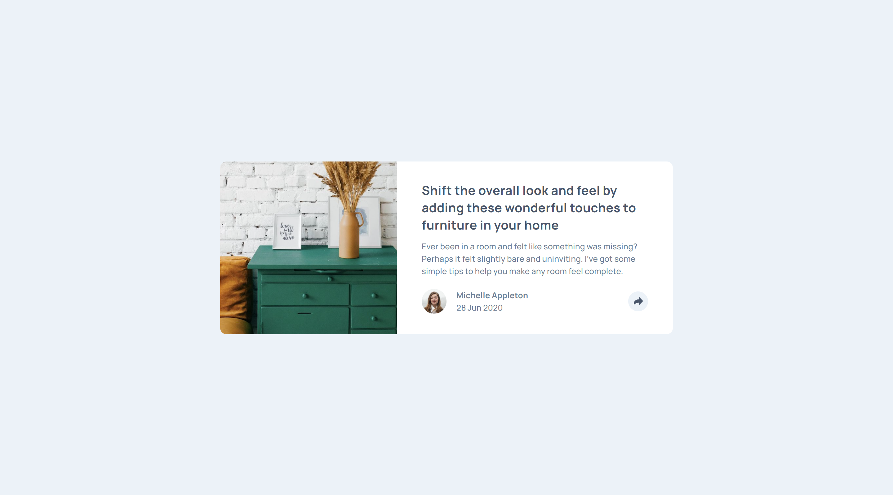

# Frontend Mentor - Article Preview Component Solution

This is my solution to the [Article Preview Component challenge on Frontend Mentor](https://www.frontendmentor.io/challenges/article-preview-component-dYBN_pYFT). Frontend Mentor challenges are designed to help you improve your coding skills by building realistic projects.

## Table of Contents

- [Overview](#overview)
  - [The Challenge](#the-challenge)
  - [Screenshot](#screenshot)
  - [Links](#links)
- [My Process](#my-process)
  - [Built With](#built-with)
  - [What I Learned](#what-i-learned)
  - [Continued Development](#continued-development)
  - [Useful Resources](#useful-resources)
- [Author](#author)
- [Acknowledgments](#acknowledgments)

## Overview

### The Challenge

Users should be able to:

- View the optimal layout for the component depending on their device's screen size.
- See the social media share links when they click the share icon.

### Screenshot



### Links

- **Solution URL:** [My here](https://www.frontendmentor.io/learning-paths/javascript-fundamentals-oR7g6-mTZ-/steps/66c4adff3c19191dc3cb3af3/challenge/refactor)
- **Live Site URL:** Visit the live site [here](https://jomagene.github.io/article-preview-component/)

## My Process

### Built With

- Semantic HTML5 markup
- CSS custom properties
- Vanilla JavaScript
- Flexbox
- Mobile-first workflow
- Media queries
- Sass/SCSS
- Query strings

### What I Learned

In this project, I particularly learned about the `toggle` method for managing the visibility of elements. Here's how I used it:

```javascript
let tooltip = document.getElementById("tooltip");

function toggleTooltip() {
  tooltip.classList.toggle("hidden");
}
```

This method simplifies the code by toggling the `hidden` class directly, instead of using an `if-else` structure like this:

```javascript
let tooltip = document.getElementById("tooltip");

function toggleTooltip() {
  if (tooltip.classList.contains("hidden")) {
    tooltip.classList.remove("hidden");
  } else {
    tooltip.classList.add("hidden");
  }
}
```

I also implemented the social media share logic using `encodeURI` and query strings. Here's how I did it:

```javascript
const link = encodeURI(window.location.href);
const msg = encodeURIComponent("Hey! I found this drawer so interesting");
const title = encodeURIComponent(document.querySelector("h1").textContent);

const socials = document.querySelector(".social-links").children;
const facebook = socials[1];
const twitter = socials[2];
const pinterest = socials[3];

facebook.href = `https://www.facebook.com/sharer/sharer.php?u=${link}`;
twitter.href = `https://twitter.com/intent/tweet?text=${msg}&url=${link}`;
pinterest.href = `https://pinterest.com/pin/create/button/?url=${link}&media=https://m.media-amazon.com/images/I/71+P1yDyRBL._AC_SX679_.jpg&description=${title}`;
```

### Continued Development

In future projects, I plan to focus on:

- **Accessibility Improvements:** Ensuring that all components are fully accessible and usable for people with disabilities.
- **Advanced CSS Techniques:** Exploring CSS Grid, animations, and transitions to create more dynamic and visually appealing layouts.
- **JavaScript Optimization:** Learning more about JavaScript best practices, including performance optimization and modular code.

### Useful Resources

- **[FreeCodeCamp Video: JavaScript and the DOM](https://www.youtube.com/watch?v=5fb2aPlgoys&t=241s&pp=ugMICgJmchABGAHKBRBmcmVlY29kZWNhbXAgZG9t):** This video helped me understand DOM manipulation and how to implement interactive features like the tooltip toggle and social media sharing.

## Author

- **Frontend Mentor:** [@Jomagene](https://www.frontendmentor.io/profile/Jomagene)
- **Twitter:** [@Jomagene](https://www.twitter.com/Jomagene)

## Acknowledgments

I would like to thank the Frontend Mentor community for providing valuable feedback and inspiration.
